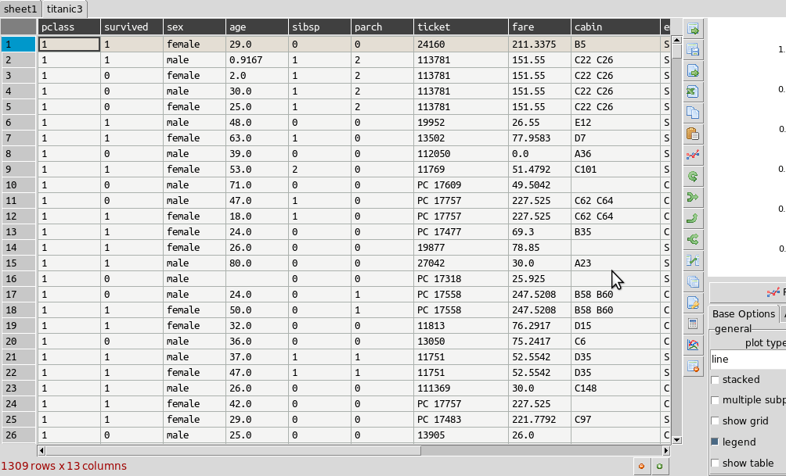
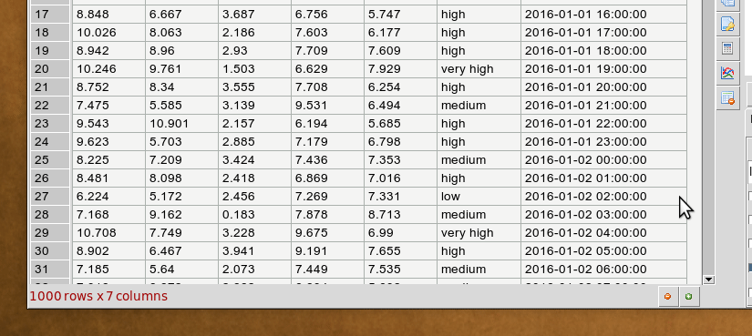
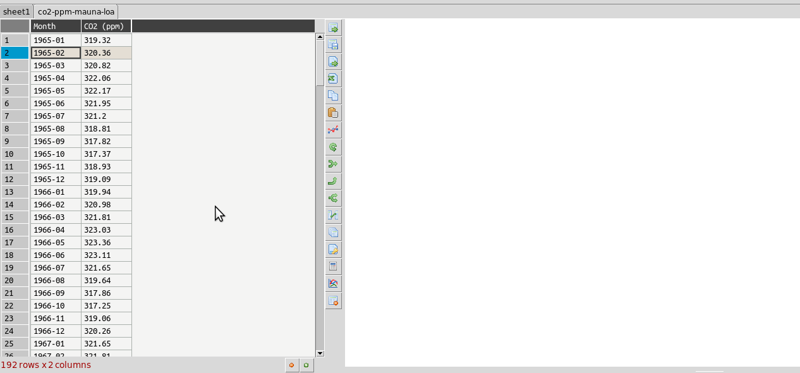
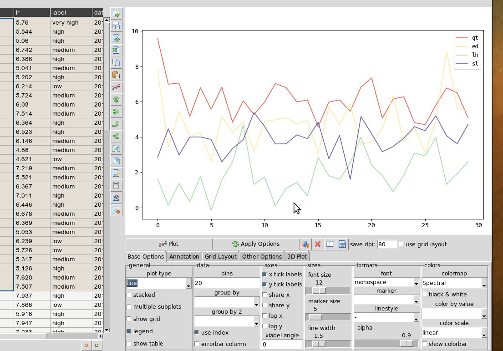

Using DataExplore
=================

This page details some of the tasks available in dataexplore. For a general introduction also see the screencast at https://youtu.be/Ss0QIFywt74.
Most of this functionality is available when you just use the table widget as well as inside the application. Installing in windows or with a snap in linux should provide a menu item to launch the app.

Purpose of the program
-----------------------

This program is for analyzing tabular data but is not meant to be a spreadsheet. Data is treated in a row/column centric fashion and a lot of the analysis is done in bulk on entire columns at once. So although you can edit cells it is not really meant for data entry. You can use a spreadsheet for that. Cell formulas are not possible for instance. You can however delete rows, columns and blocks of clear blocks of cells. New columns can be created through the use of functions. The primary goal is to let users explore their tables interactively without any prior programming knowledge and make interesting plots as they do this. One advantage is the ability to load and work with relatively large tables as compared to spreadsheets. So several million rows should not be a problem and is limited only by your computer memory.

Table layout
------------

The table is laid out with headers for row and columns. Much functionality can be accessed from the tools menu but also but right clicking on the row and column headers. You can resize columns by dragging in the header. Rows cannot be resized independently (zoom in to enlarge). Unlike spreadsheets column and ro headers can use indexes. You can set any column as an index. This has extra functionality when it comes to plotting.

.. image:: table_overview.png
     :scale: 65%

Command Line
------------

Launching dataexplore from the command line allows you to provide several options using unix type '-' switches.

**Show help:**

``dataexplore -h``

**Open a project file:**

``dataexplore -p <project file>``

**Open a dataframe stored as a messagepack file:**

``dataexplore -f <msgpack file>``

**Open a csv file and try to import it:**

``dataexplore -i <csv file>``

**Launch a basic test table with no plot frame**

``dataexplore -t``

Import Text Files
-----------------

Import of csv and general plain text formats is done from the file menu, toolbar or by right-clicking anywhere in the table and using the context menu. The dialog has most basic options such as delimiter, header selection, comment symbol, rows to skip etc. When you change the import option you can update the preview to see if the new table will look correct. You then press import. Note that it is generally a good idea to remove lines and bad data if you can before importing.

Saving data
-----------

Dataexplore projects (multiple groups of sheets with the plot view for each) are saved in **messagepack** format and have the .dexpl file extension. Tables can also be saved on their own as messagepack or pickle files and then opened directly in Python. Using the messagepack format is more efficient than csv as it takes up less space and loads faster. Though quite reliable and efficient, it is not recommended that you use these formats for long term backup, *always keep a copy your raw data* if it is important. Exporting to csv is also possible and saving individual tables to excel.

Cleaning Data
-------------

Pandas supports a variety of options for data 'cleaning' or dealing with missing data. The most basic are available from DataExplore from the main menu.

* Drop rows/columns with missing (empty) data
* Fill missing data with a symbol
* Forward or backfill with neighbouring row values
* Interpolate missing data (filling in the points between)
* Drop duplicates

String operations
-----------------

Accessed by right clicking on the column header menu. String operations can be carried out on any column as long as they are object data types and not float or integers. You can change the column type in the context menu if needed.

The following string methods are supported:

* split, with separator symbol - will create multiple new columns
* strip, remove whitespace
* lower/upper case conversion
* title, convert to TitleCase
* swap case
* get length of string
* concat, concatenate strings in first two cols with given separator
* slice, slice string by start/end indexes
* replace

Summarizing and grouping data
-----------------------------

For overall table statistics you can use the tools->describe table command. For individual columns you can get value counts by right clicking on the header.

The primary way to summarize data is to use the aggregate dialog. It is accessed on the right toolbar. Tables can be grouped and aggregated on multiple columns to create new summary tables. The results will be placed in the sub table below the main one and can then be copied to new sheets. Normally you would group by category columns (rather then a continuous variable like decimal numbers). The dialog has a list of columns to group by and another list box for column(s) to aggregate these groups using one or more functions. See the animated example (click to enlarge):

It is often easiest to test the selections out until you get the required result.

Merging two tables
------------------

Merging tables is done in dataexplore by first putting your second table in the sub-table below. You can do that by pasting it from another sheet or making an empty sub-table and importing. Once this is done you open the merge dialog in the toolbar. You select which columns in each table to merge on (at least one columns should be shared between each). The apply and the result is opened in the dialog to preview. You can copy this to a new sheet.

Pivoting tables
---------------

Pivot tables is an operation some people might be familiar with from excel. A pivot might best be described as way of summarizing data by 'unstacking' the grouped data into new columns. It is a more specialized version of the aggregation method above. A comprehensive explanation is given here: https://www.dataquest.io/blog/pandas-pivot-table/

Filtering tables
----------------

Filtering tables is done using either a string query and/or one or more pre-defined filters defined with widgets. Pressing the filtering button will bring up the dialog below the table. Manual predefined filters can be added by pressing the + button. These are used alone or in conjunction with the string query as shown below. The filters are joined together using the first menu item using either 'AND', 'OR' or 'NOT' boolean logic. When filtered results are found the found rows are highlighted. You can also limit the table to show the filtered set which can be treated as usual (i.e. plots made etc). Closing the query box restores the full table. If you want to keep the filtered table you can copy and paste in another sheet.
String based query are made up fairly intuitive expressions. The one caveat is that column names cannot contain spaces to be used in an expression. It is best in these cases to convert column names (i.e. replace spaces with an underscore '_').

Applying functions
------------------

Unlike a spreadsheet there are no cell based formulas. Rather functions are applied to columns over all rows, creating a new column. New columns can be created in several ways through computations on other columns. The column header menu provides some of these like resample/transform a column or the apply function dialog. Another more general way to add functions is to use the calculation button on the toolbar. This brings up a dialog below the table where you can type function as text expressions.

The same as for filtering, a string is entered like a formula and if it can be parsed a new column is created. For example entering 'x = a + b' will create a new column x that is the sum of a and b.

Examples::

    x = a+b  #sum a and b
    x = a*a  #a squared
    x = sin(a)
    x = sqrt(a+b)/log(c)

Supported functions in expressions:  sin, cos, tan, arcsin, arccos, arctan, sinh, cosh, tanh, log, log10, exp

Resampling columns
------------------

Resampling is a way to average data over specific windows or periods. It is a possible way to smooth out noisy data for example or get an average trend. You can resample columns from the column header menu. In the example below this is used to smooth out the sawtooth shaped C02 data. The larger the window the more averaging will take place.

Plotting grouped data
---------------------

Rather than grouping the table directly it is also possible to plot data grouped. This requires you select the appropriate columsn including the one to be grouped by and select the grouping column in the 'groupby' menu in the plot options. Plots can be grouped by 2 columns at once.

Plotting in a grid
------------------

The gif animation below shows how to use the grid layout tool to generate subplots by clicking and dragging in the grid to select the area for your next plot. Note that subplots will be overwritten if you select the same cell as one currently occupied but if you drag over this cell the region will be plotted over. The tool assumes the user will know how to avoid overlaps. So it’s best to have a good idea of how to layout the plots beforehand, or just use trial and error. You can remove subplots from the drop down menu, listed according to their positions.

Grid layout includes other modes 'split data and ‘multiview’. Split data lets you pick a grid size and splits up the rows into chunks, plotting each separately. The multiview mode allows you to auto-generate different kinds of plot in the grid for the same data every time you plot. This could be useful for quickly previewing regions of data repeatedly without having to set the plot type each time. This will overwrite whatever plot you currently have displayed. The feature is also illustrated in the gif above.

Table Coloring
--------------

Column colors can be set by right clicking in the column header and choosing 'set color'. A color picker will open. The formatting is saved with the project file. You can clear the formatting from the table popup menu.

You can set row and cell colors in several ways. Firstly, if right clicking on the row header or inside the table the 'set color' option lets you color the selected rows/columns with a single color. You can also set colors for the entire table/column according to the cell values. This is done by choosing 'color by value' from the column header and will allow you to select a color map. String values will be mapped to categorical integers and then to colors. See below:

.. image:: table_colors.png
       :scale: 50 %

For very large tables, adding colors for all cells will increases the file size of saved projects.

Other examples
--------------

Other guides are available as blog posts:

* http://dmnfarrell.github.io/dataexplore/2015/09/15/titanic-example
* http://dmnfarrell.github.io/dataexplore/2017/07/05/grouped-plots
* http://dmnfarrell.github.io/dataexplore/2016/11/20/sea-ice-example
